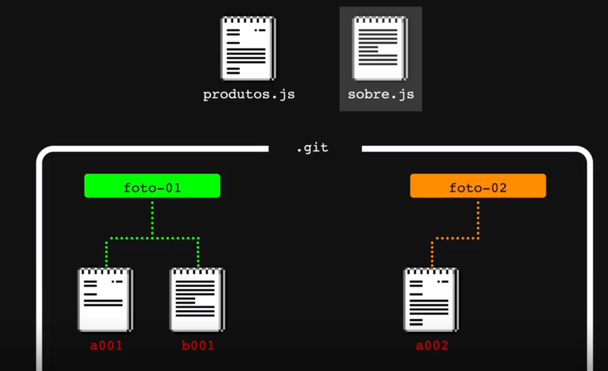

# clone-tabnews
novo curso do tabnews

# Protocolos

Http - hypertext transfer protocol
Ftp  -  file transfer protocol
SMTP - simple mail transfer protocol

tcp - identificar se está chegando os pacotes no cliente
udp - user datagram protocol
ip - 
geckos.io -lib

file base routing- roteamento baseado em arquivos 
produtos.php -> /produtos

## versionamentos
centralizados = sccs, rcs cvs svn
distribuidos = git

por meio do git tem o blob, que é como se fosse um snapshot do arquivo,
commit tal como um compromisso.

## status de arquivos.

moddified, staged, commit and untracked(Não faz parte diretamente).

existe o .gitignore para remover alguns que não precisamos mais.

caractere invisível